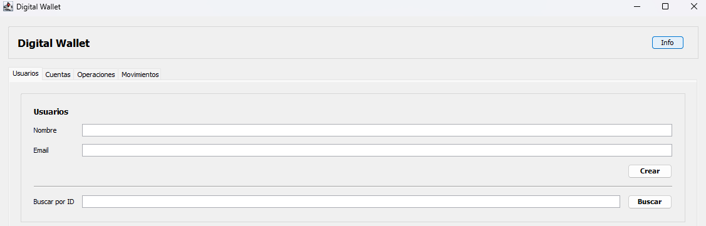
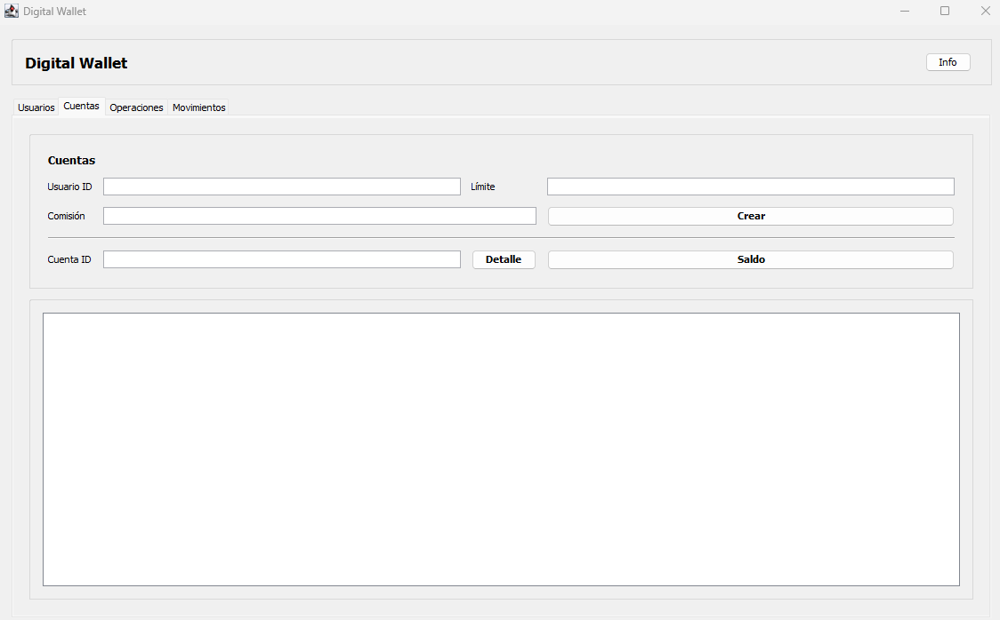
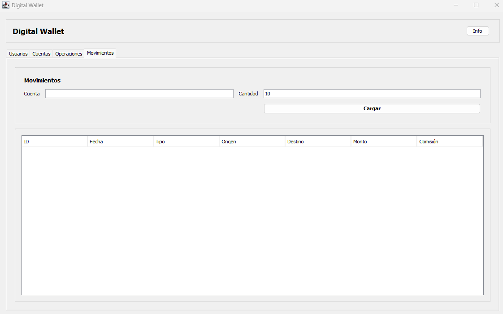
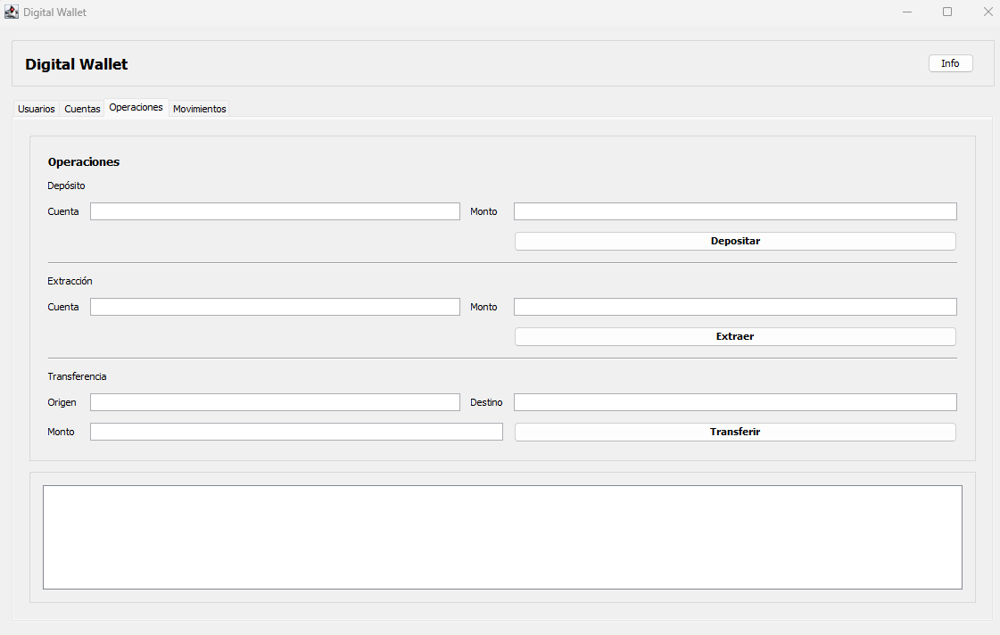

# Digital Wallet App – Java POO

Aplicación de **billetera digital** desarrollada en **Java**, utilizando **Programación Orientada a Objetos** y **arquitectura en capas**, con persistencia de datos en **MySQL** y una interfaz gráfica construida con **Swing**.

El proyecto simula el funcionamiento básico de un sistema bancario, permitiendo la gestión de usuarios, cuentas y transacciones financieras.

---

## Objetivo del proyecto

Construir una aplicación sólida y mantenible que demuestre:
- Uso correcto de los pilares de la POO
- Separación de responsabilidades mediante arquitectura en capas
- Persistencia de datos con MySQL
- Manejo de lógica de negocio y excepciones
- Desarrollo de una interfaz gráfica funcional y clara
- Buenas prácticas de configuración y seguridad

---

## Funcionalidades

- Creación y consulta de usuarios
- Creación de cuentas corrientes
- Consulta de saldo
- Depósitos y extracciones
- Transferencias entre cuentas
- Registro y visualización de movimientos
- Manejo de estados y validaciones de negocio

---

## Arquitectura

El proyecto sigue una arquitectura en capas.
Cada capa cumple una única responsabilidad y se comunica con las demás mediante contratos bien definidos.

---

## Tecnologías utilizadas

- Java 
- Swing
- MySQL
- JDBC

---

## Base de datos

Los scripts SQL necesarios para crear y poblar la base de datos se encuentran en la carpeta:
db/

### Script

- `schema.sql`  
  Contiene la definición completa de la base de datos y las tablas.

## Ejecución del proyecto

### Requisitos
- Java 
- MySQL 

### Ejecución 
- Ejecutar la clase `Main/App.java`

## Project

## Estado del proyecto

Proyecto completo y funcional finalizado.